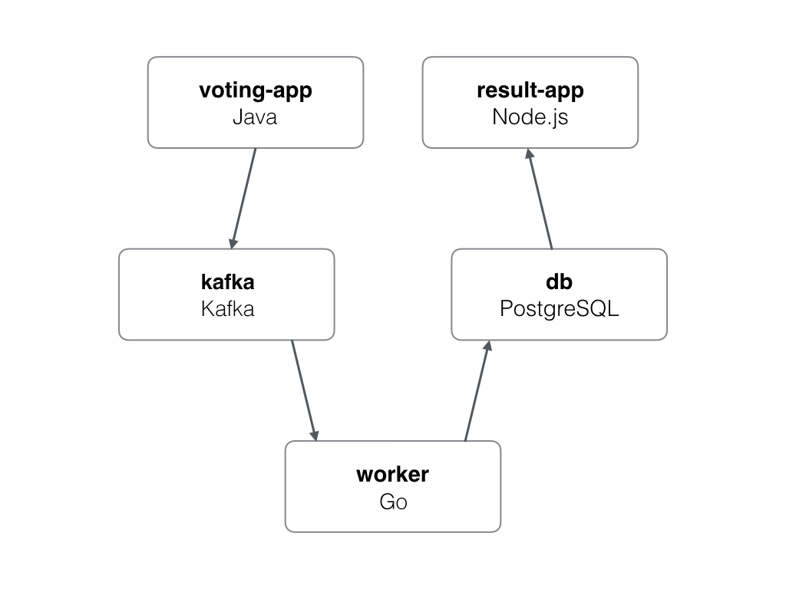

# 4. Diagrama de Arquitectura

## Diagrama del Sistema

---

## Descripción de Componentes

El sistema se compone de cinco piezas fundamentales:

1.  **Frontend de Votación (Vote):** Permite a los usuarios elegir entre dos opciones. Desarrollado en Java con Spring Boot.
2.  **Mensajería (Kafka):** Broker de mensajes que recibe los votos del frontend de forma asíncrona.
3.  **Procesador (Worker):** Servicio en Go que consume mensajes de Kafka y los persiste en la base de datos PostgreSQL.
4.  **Base de Datos (PostgreSQL):** Almacenamiento persistente de los votos.
5.  **Frontend de Resultados (Result):** Interfaz en Node.js que muestra los resultados en tiempo real consultando a PostgreSQL.

---

## Flujo de Datos

1.  El usuario envía un voto a través de la interfaz web de `vote`.
2.  El servicio `vote` publica un mensaje en el tópico `votes` de **Kafka**.
3.  El servicio `worker` detecta el nuevo mensaje, lo procesa e inserta el registro en **PostgreSQL**.
4.  El servicio `result` lee continuamente la base de datos y actualiza la interfaz de usuario mediante **WebSockets** (Socket.io).
