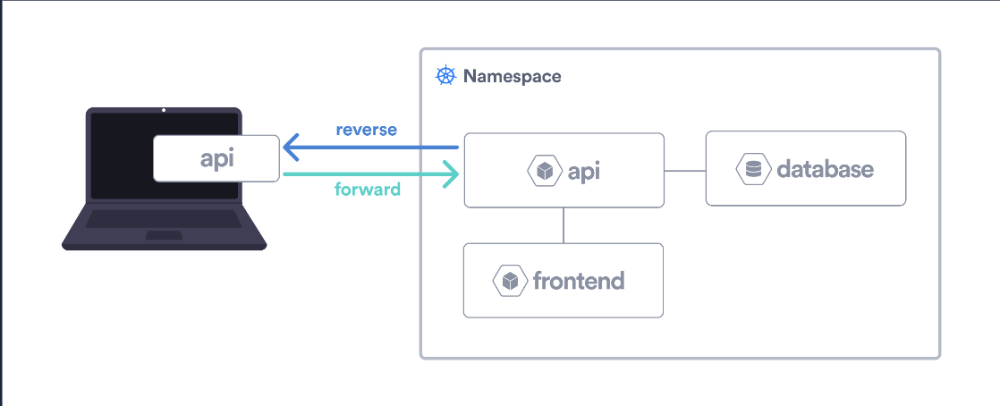

# Microservices Demo

A demo application with Java, Go, Javascript, Kafka and PostgresQL.

## Architecture


* A front-end web app in [Java](/vote) which lets you vote between Tacos and Burritos
* A [Kafka](https://bitnami.com/stack/kafka/helm) queue which collects new votes
* A [Golang](/worker) or worker which consumes votes from Kafka and stores them in PostgresQL
* A [PostgresQL](https://bitnami.com/stack/postgresql/helm) database
* A [Node.js](/result) webapp which shows the results of the voting in real time

## Run the Microservices Demo in Okteto

```
$ git clone https://github.com/okteto/microservices-demo
$ cd microservices-demo
$ git checkout hybrid
$ okteto deploy
```

## Hybrid Mode

Hybrid mode means the microservice you are actively developing is running locally in your machine, and the rest of the application is running in the remote cluster.
As part of the `okteto up` sequence, Okteto creates forward and reverse tunnels to connect your local process with the remote container.



In the figure, we can see how the *api* microservice is running locally, but it's connected via forward/reverse tunnels with the containers running in the cluster.

It's worth noting that your local process inherits the original deployment environment variables and secrets.

###  When to use Hybrid Mode

A typical use case for using `hybrid` development mode is when you’re using a framework that is IDE-heavy. For example, on Java/Spring, IDEs tend to be pre-configured to run tests, start services, and connect debuggers. You lose some of that ‘click and you are done’ when you are using the traditional `okteto up` and the default `sync` mode.

**Note**: keep in mind that using `hybrid` mode may break replicability between Operating Systems (local and remote) and add latency when accessing other services in the cluster.

### How to use Hybrid Mode

To use `hybrid` mode you only need to configure the necessary ports to expose by the process running on your local machine using the `reverse` field. This enables other components running on the cluster to communicate with your local process as if your local process was running in the cluster as well.

## Tutorial

In this sample we will use `hybrid` mode to develop the *vote* microservice. To do that, we configure the following dev container in the okteto manifest:

```yaml
dev:
  vote:
    mode: hybrid
    command: bash
    workdir: vote
    reverse:
    - 8080:8080
```

Running `okteto up vote` will give me a `bash` terminal where I can run `mvn spring-boot:run` to start developing my application.
My local maven process will be still available from its okteto endpoint because the local port `8080` is accessible via a reverse tunnel to the cluster.

The *vote* components connects to Kafka. To make kafka available from my local java process, I need to add the following `forward` to my okteto manifest:

```yaml
forward:
  - 9092:kafka:9092
```

This will make `kafka` available at localhost. You can change the code of the *vote*  microservice to connect to kafka on `localhost`, or add the following entries to your `/etc/hosts` file:

```
127.0.0.1 kafka
127.0.0.1 kafka-0.kafka-headless.<<your-namespace>>.svc.cluster.local
```
